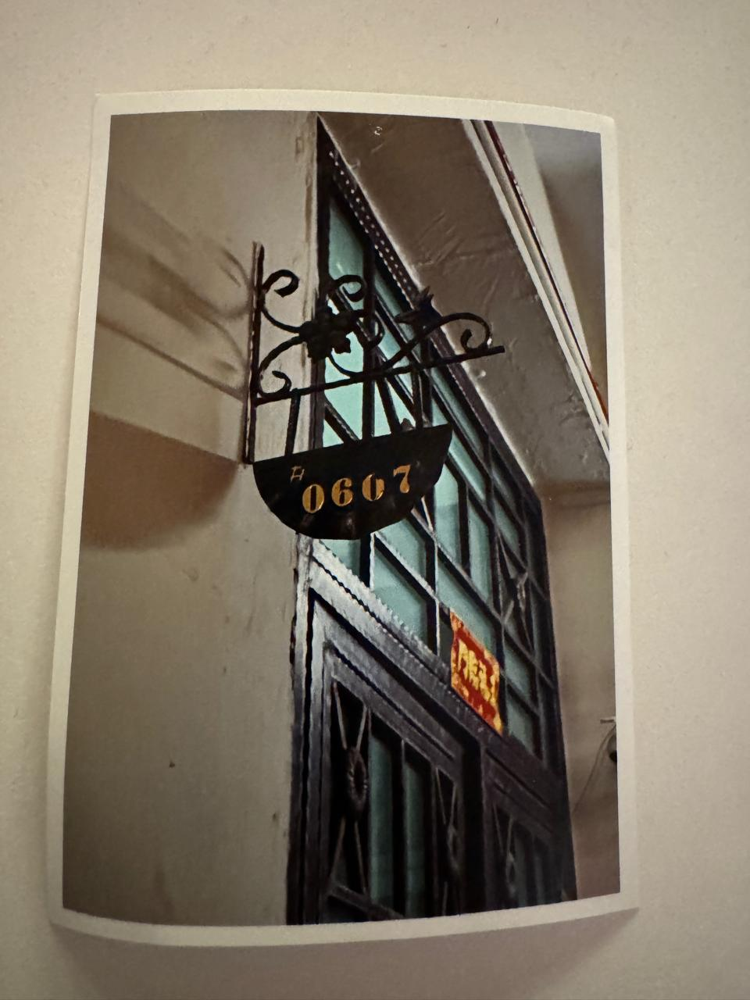

# Agent-0067

This is a game which uses our webcam to detect head and hand gestures. The movement is the control element in the game. Moving head shifts the character to either sides and doing 67 viral meme fires bullets. 

In the game, you find many obstacles which are risky and rewarding. Eliminating them with your bullers earns you 10pts whereas them striking you will make you lose 5pts. You have to dodge them and at the same time, align yourself straight in front of them to shoot. 

# Theme

If you're wondering how "67" is our theme, Its a partial picture of door with number 0607, we basically removed two zeros. 
Hence, 67 is derived. 

Regarding agent, its inspired by james bond movie and the same movie inspired the game idea as well.

_If you want to take a look at the picture:_

# Tech Stack

Backend: nodejs and express
Frontend: React with vite
Motion detection: mediapipe mapping library
Real Time Communication: websockets

# What is this game for ?

You can play it singleplayer and set your personal best friend. 
If you want to challenge someone, select multiplayer and compete with them to find out who gets the highest point. As a cherry on top, there is a live real-time leaderboard so you could track progress easily. 

## Thank You :)